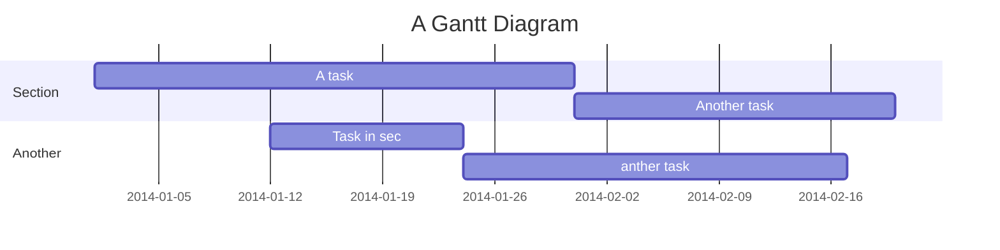

<center>
    


</center>

## Table of Contents

[TOC]

## What is FastAPI

:::info
FastAPI is a modern, fast, and highly efficient web framework for building APIs (Application Programming Interfaces) with Python. It is designed to be easy to use, scalable, and capable of handling high-performance applications. FastAPI is built on top of Starlette, a high-performance asynchronous web framework, and uses Python's type hints to provide automatic request and response validation, making it easy to build robust and well-documented APIs.
:::

## User story

```gherkin=
Feature: Guess the word

  # The first example has two steps
  Scenario: Maker starts a game
    When the Maker starts a game
    Then the Maker waits for a Breaker to join

  # The second example has three steps
  Scenario: Breaker joins a game
    Given the Maker has started a game with the word "silky"
    When the Breaker joins the Maker's game
    Then the Breaker must guess a word with 5 characters
```

> I choose a lazy person to do a hard job. Because a lazy person will find an easy way to do it. [name=Bill Gates]

```gherkin=
Feature: Shopping Cart
  As a Shopper
  I want to put items in my shopping cart
  Because I want to manage items before I check out

  Scenario: User adds item to cart
    Given I'm a logged-in User
    When I go to the Item page
    And I click "Add item to cart"
    Then the quantity of items in my cart should go up
    And my subtotal should increment
    And the warehouse inventory should decrement
```

> Read more about Gherkin here: https://docs.cucumber.io/gherkin/reference/

## User flows

```sequence
Alice->Bob: Hello Bob, how are you?
Note right of Bob: Bob thinks
Bob-->Alice: I am good thanks!
Note left of Alice: Alice responds
Alice->Bob: Where have you been?
```

> Read more about sequence-diagrams here: http://bramp.github.io/js-sequence-diagrams/

## Project Timeline



> Read more about mermaid here: http://mermaid-js.github.io/mermaid/

## Appendix and FAQ

:::info
**Find this document incomplete?** Leave a comment!
:::

## Math Formula

$\sum_{i=0}^n i^2 = \frac{(n^2+n)(2n+1)}{6}$
